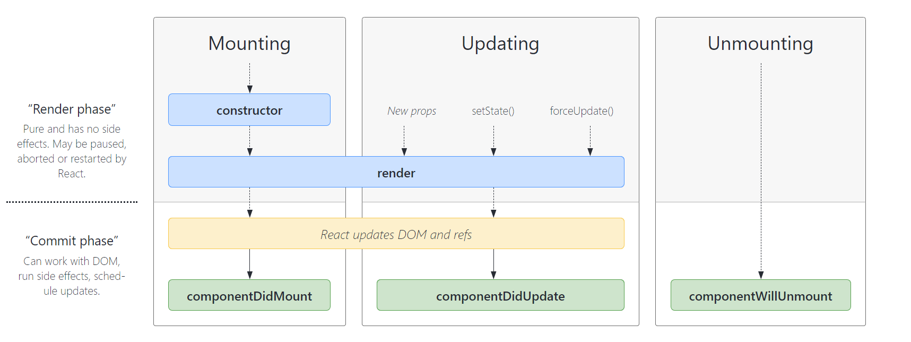

JSX 基本使用、父子组件通信、生命周期、setState

<!-- more -->

#### 0.React设计理念

1. 单向数据流
   - 数据与界面绑定
   - 单向渲染
   - 类似函数，同样的输入，同样的输出
2. 虚拟 `DOM`
   - 在 `JS`  和真实的 `DOM` 间添加了虚拟 `DOM` 层，如果真实的 `UI` 需要更新，对比两个 `UI` 最小的差距进行重新渲染
3. 组件化
   - 保持交互一致性和视觉风格统一
   - 便于复用和相互协作

#### 1.JSX 基本使用

- 变量、表达式
- class style
- 子元素和组件

#### 2.条件判断

#### 3.事件

React 自己的事件机制称为合成事件，如果要获得元素 DOM 事件可以用 e.nativeEvent

```jsx
<button onClick = {handlerClick}>click<button>
    
const handlerClick = (e) =>{
	console.log(e.nativeEvent)
}
```

先处理原生事件，在处理 React 事件，最后真正执行 document 上挂载的事件

- react 注册的事件最终会绑定在 root 这个 DOM 上，而不是 React 组件对应的 DOM(减少内存开销就是因为所有的事件都绑定在document上，其它节点没有绑定事件)
- react 自身实现了一套事件冒泡机制，所以我们使用 event.stopPropagation() 是无效的
- react 有一套自己的合成事件 SyntheticEvent

#### 4.表单

#### 5.父子组件通信

##### 5.1 父组件向子组件传递数据

```react
// 父组件在使用子组件时添加数据，子组件用 this.props 获取
// 父组件：
<List list = {this.state.list}/>
// 子组件 List
const {list} = this.props
```

##### 5.2 父组件向子组件传递函数

和传递属性差不多

```react
// 父组件定义函数 onSubmitTitle，在标签中传递给子组件 Input
 <Input submitTitle = {this.onSubmitTitle}/>
// 子组件通过 this.props 获取这个函数，同时传递自己的参数
<button onClick={this.onSubmit.bind(this)}> 提交</button>
onSubmit(){
        const { submitTitle } = this.props
        submitTitle() // 里面是否传参，传递什么参数，看父组件怎么定义的
}
```

为了确保父组件中使用子组件时传递的参数正确，还可以添加类型检查。(当然传递属性时也可以限制类型)

```react
import PropTypes from 'prop-types'
// 类型检查
Input.propTypes = {
    submitTitle: PropTypes.func.isRequired
}
```

##### 5.3状态提升

比如说两个子组件 List 组件和 Input 组件都需要一个 list 列表数据，前者只负责渲染，后者只负责修改，那么 list 列表数据就可以放在父组件中，由父组件来统一调配，这称做状态提升

#### 6.setState (important)

异步更新，同步执行

##### 6.1 不可变值

要在 setState 里面修改数据，在修改状态时千万不能改变原来的状态state。shouldMountUpdate生命周期中会将要改变的值与之前的值做个比较来确定是否改变视图，以这种方式来优化性能

```react
// 1. state 在 constructor 里面定义
constructor(props) {
        super(props)

        // 第一，state 要在构造函数中定义
        this.state = {
            count: 0,
            list: [1,2,3,4,5],
            obj1: {a: 100},
            obj2: {x: 100}
        }
}
// 2. 第二，不要直接修改 state ，使用不可变值
// this.state.count++ 是错误的
this.setState({
    	count: this.state.count + 1, // SCU
    	list: this.state.list.concat(6), // 不能用 push pop splice 等会改变原数组的 api 
    	obj: Object.assign({}, this.state.obj1, {b: 200}),
    	obj1: {...this.state.obj1, y: 200}
		
})

```

##### 6.2 可能是异步更新

① setState 异步的情况

```react
constructor(props) {
        super(props)
        this.state = {
            count: 0
        }
    }
    render() {
        return <div>
            <p>{this.state.count}</p>
            <button onClick={this.increase}>累加</button>
        </div>
    }
    increase = () => {
        this.setState({
            count: this.state.count + 1
        })
        console.log(this.state.count);  // 只能拿到修改前的值
        
    }
```

如果一定要拿到新值，可以在 setState 中加回调函数，相当于 vue 中的 $nextTick

```react
this.setState({
            count: this.state.count + 1
        },()=>{
            console.log('回调函数打印的值',this.state.count);
})
```

② setState 是同步的情况

```react
// 1. 在 setTimeout 中是同步的
increase = () => {
        setTimeout(() => {
            this.setState({
                count: this.state.count + 1
            })
            console.log('setTimeout 打印的值',this.state.count); // 打印的值是最新值
        }, 0);
        
}
componentWillUnmount() {
        // 及时销毁定时器
        clearTimeout
}
```


```react
// 2. 在自定义的 DOM 事件中是同步的
componentDidMount(){
        document.body.addEventListener('click', this.clickHandler)
}
clickHandler = ()=>{
        this.setState({
            count: this.state.count + 1
        })
        console.log('body 打印的值',this.state.count);
}
// 注意及时销毁
componentWillUnmount() {
        // 及时销毁自定义 DOM 事件
        document.body.removeEventListener('click', this.bodyClickHandler)
}
```


##### 6.3 可能会被合并

① 传入对象时会被合并

```react
// 传入对象，会被合并（类似 Object.assign ）。执行结果只一次 +1
        this.setState({
            count: this.state.count + 1
        })
        this.setState({
            count: this.state.count + 1
        })
        this.setState({
            count: this.state.count + 1
        })
```

② 传入函数时不会被合并

```react
// 传入函数，不会被合并。执行结果是 +3
        this.setState((prevState, props) => {
            return {
                count: prevState.count + 1
            }
        })
        this.setState((prevState, props) => {
            return {
                count: prevState.count + 1
            }
        })
        this.setState((prevState, props) => {
            return {
                count: prevState.count + 1
            }
        })
```


#### 7.React 生命周期

- Mounting: 创建虚拟 DOM ， 渲染 UI
- Updating：更新虚拟 DOM， 重新渲染 UI
- Unmounting：删除虚拟 DOM，移除 UI

单组件生命周期（父子组件生命周期和 Vue 一样）



