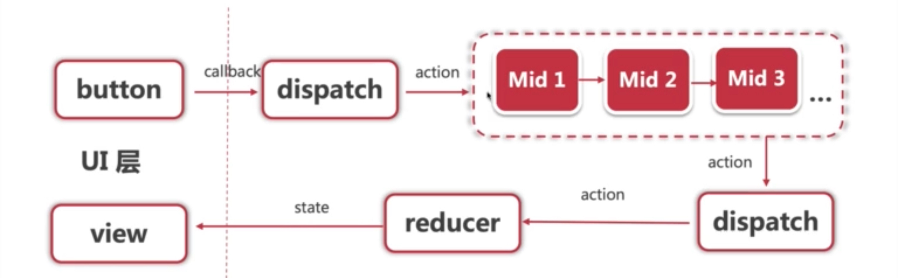

函数组件、非受控组件、异步组件

<!-- more -->

#### 1.函数组件

- 相当于 class 组件的简化版本，没有什么逻辑，只是简单渲染 props；

- 纯函数，输入 props，输出 JSX

- 没有实例，没有生命周期，没有 state

- 不能扩展其它方法

```react
// class 版
class ListDemo extends React.Component{
    constructor(props){
        super(props)
    }
    render(){
        const { list } = this.props
        return(
             <ul>
                 { this.state.list.map((item, index)=>{
                         return( <li key={item.id}>
                            index: {index}；
                            id: {item.id}；
                            title: {item.title}</li> ) }) }
            </ul>
)}}
```


```react
// 函数组件版
function List(props){
    const { list } = this.props
    return (
        <ul>
            {list.map(()=>{
                return <li key={item.id}>
                     index: {index}；id: {item.id}；title: {item.title}
                </li>
            })}
        </ul>
    )
}
```


#### 2.非受控组件

- 必须手动操作 DOM 元素，setState 实现不了；
- 文件上传 `<input type='file'>`；
- 某些富文本编辑器

##### 2.1 ref、defaultChecked，defaultValue

在 vue 里面，dom 节点可以直接赋值成一个 ref 属性的字符串，然后直接获取。在 react 流程也差不多，但是 ref 需要是 `React.createRef() `创建的一个对象。

```react
constructor(props){
        super(props)
	    this.state = {
            name: 'Dmoon',
            flag: true,
         }
        // ref 的创建规则
        this.ref1 = React.createRef()  
        this.ref2 = React.createRef()
    }
```

使用 ref 

```react
// 1. input 中使用 ref ：不需要绑定 onChange 事件，value 改成 defaultValue，赋值 ref 属性
// 因为没有 onChange 事件，所以 input 里的数据改变不会影响 span 的数据
<div>
     {/* 使用 defaultValue 而不是 value ，使用 ref */}
     <input defaultValue={this.state.name} ref={this.nameInputRef}/>
     {/* state 并不会随着改变 */}
     <span>state.name: {this.state.name}</span>
     <br/>
     <button onClick={this.alertName}>alert name</button>
</div>
// 获取 DOM 节点 
alertName = () => {
    	// state 中的值不会改变，要拿到新的值，要从 ref 获取
        const elem = this.nameInputRef.current // 通过 ref 获取当前 DOM 节点
        alert(elem.value) // 不是 this.state.name
}

```


```react 
// 2. CheckBox 作为非受控组件 checkbox defaultChecked，我们点击修改是否选中 checkbox 时不会影响 state 中flag的值
<div>
            <input
                type="checkbox"
                defaultChecked={this.state.flag}
            />
 </div>
```

##### 2.2 手动操作 DOM 元素

读取文件时，必须要手动获取 DOM 操作，此时就要用上 ref

```react
alertFile = () => {
        const elem = this.fileInputRef.current // 通过 ref 获取 DOM 节点
        alert(elem.files[0].name)
    }
render(){
        return <div>
        	<input type="file" ref={this.fileInputRef}/>
        	<button onClick={this.alertFile}>alert file</button>    
        </div>

}
```


#### 3.Portals

中文翻译为传送门，组件默认会按照层级渲染，但是有时我们会需要渲染到父组件以外。

- 父组件使用了 `overflow: hidden` , 限制了子组件的展示，那么就可以使用 *Portals* 让子组件逃离父组件；
- 父组件 `z-index` 值太小，
- `fixed` 需要放在 *body* 第一层

```react
// 假设 model 的 css 为 position: fixed;
import ReactDOM from 'react-dom'
render(){
		// 两个参数，一个是要渲染的节点，一个是需要挂载的地方
        return ReactDOM.createPortal(
            <div className="model">{this.props.children}</div>,
            document.body // DOM 节点
        )
}
```

#### 4.context

- 管理一些比较简单的公共数据的地方，比如说语言，主题等
- 函数组件 和 class 组件使用起来略有不同，但是思路一致
- xxxContext.Provider 包裹需要使用 Context 的组件
- .Consumer  + value 消费 Context

eg1

```JSX
// 1. 创建 context 并传参
// 需要一个默认值，可以额外定义也可以直接传
const defaultContextValue = {
  userName: 'Dmoon'
}
// 通过 React.createContext 新建一个 context
export const appContext = React.createContext(defaultContextValue)
// contextName.Provider 包裹组件，把 Context 传过去
<appContext.Provider value={defaultContextValue}>
      <App/>
</appContext.Provider>
// 2. 组件使用 context
import React, {useContext} from "react";
import { appContext } from "../index";  // context 定义的路径
// 假设 App 组件有一个子组件 Child
// 2.1 如果使用一般的模式
const Child = ()=>{
     return (
        <appContext.Consumer>
        {(value)=>{
             return <div>
            {value.userName}
        	</div>
        }}
        </appContext.Consumer>
    )
   
}
// 2.2 使用钩子的形式
const Child = ()=>{
    const value = useContext(appContext);
    return <div>
        {value.userName}
    </div>
}


```


```react
import React from 'react'

// 1. 创建 context  括号中的参数是默认值
const ThemeContext = React.createContext('light')

// 2. 管理 context 的最外层组件
class ContextDemo extends React.Component{
    constructor(props){
        super(props)
        this.state = {
            theme: 'light'
        }
    }
    changeTheme = ()=>{
        this.setState({
            theme: this.state.theme === 'light'?'dark':'light'
        })
    }
    render(){
        // 包括父组件总共有三层  ContextDemo → ToolBar → ThemeLink 和 ThemedButton
        return (
            <ThemeContext.Provider value={this.state.theme}>
                <Toolbar />
                <hr/>
                <button onClick={this.changeTheme}>change theme</button>
            </ThemeContext.Provider>
        )
    }
}

// 3.ToolBar 层
function Toolbar(props) {
    return (
        <div>
            <ThemedButton />
            <ThemeLink />
        </div>
    )
}

// 4.1 底层组件 - 函数式组件
function ThemeLink (props) {
    // const theme = this.context // 会报错。函数式组件没有实例，即没有 this
    // 函数式组件可以使用 Consumer
    return <ThemeContext.Consumer>
        { value => <p>link's theme is {value}</p> }
    </ThemeContext.Consumer>
}

// 4.2 底层组件 - class 组件
class ThemedButton extends React.Component {
    // 指定 contextType 读取当前的 theme context。
    // static contextType = ThemeContext // 也可以用 ThemedButton.contextType = ThemeContext
    render() {
        const theme = this.context // React 会往上找到最近的 theme Provider，然后使用它的值。
        return <div>
            <p>button's theme is {theme}</p>
        </div>
    }
}
// 需要指明 class 组件的 context 是谁
ThemedButton.contextType = ThemeContext 
export default ContextDemo
```


#### 5.异步组件

主要是为了性能优化，可以在 performance 里面把网速设置成 3G，然后再 network 里选 JS 再刷新看效果

```react
import React from 'react'
// React.lazy 封装一下，然后 import 我们要的组件
const ContextDemo = React.lazy(() => import('./ContextDemo'))

class App extends React.Component {
    constructor(props) {
        super(props)
    }
    render() {
        return <div>
            <p>引入一个动态组件</p>
            <hr />
            {/* React.Suspense 标签加载异步组件  
            	fallback={<div>Loading...</div>} 是我们在加载异步组件但还没完成时页面上显示的内容
            */}
            <React.Suspense fallback={<div>Loading...</div>}>
                <ContextDemo/>
            </React.Suspense>
        </div>

        // 1. 强制刷新，可看到 loading （看不到就限制一下 chrome 网速）
        // 2. 看 network 的 js 加载
    }
}

export default App

```


#### 6.性能优化 (important)

相对于 vue 来说，性能优化对 react 更加重要，*setState* 的不可变值在这个部分一定要谨记

##### 6.1 SCU (shouldComponentUpdate)

```react
shouldComponentUpdate(nextProps, nextState){
        if(nextState.count !== this.state.count){
            return true // 可以渲染
        }
        return false  // 不可以渲染

 }
```

核心问题是：为什么要有 `shouldComponentUpdate` 这个生命周期，默认返回 `true` 不就可以了吗？

1. 因为react 默认如果父组件更新，子组件也会更新，即使子组件实际数据没有改变。
2. 性能优化对 React 更重要
3. SCU 不一定每次都要用，需要性能优化的时候再用
4. 必须配合不可变值使用

```react
// 对于第 4 点的说明，情景：给从 input 给列表添加数据
// 错误的写法：push 会改变原数组,所以修改的数据前后是一样的
onSubmit = ()=> {
    this.state.list.push('input-value')
    this.setState({
        list: this.state.list
    })
}
// 此时的 SCU 比较，不管怎么比较都是 false，因为 nextState 和 this.state 里面的 list 值是一样的，页面也不会重新渲染

// 正确的写法：使用 concat 等不会改变原数组的api
onSubmit = ()=>{
    this.setState({
        list: this.state.list.concat('input-value')
    })
}


```

PS 自定义的 SCU 中最好不要使用深度比较，因为深度比较一次递归到底，比较耗费性能

##### 6.2 PureComponent 和 React.memo

- `PureComponent` 在 `SCU` 中实现浅比较， 属于 class 组件
- `React.memo`, 函数组件中的 `PureComponent`
- 大部分情况都是用浅比较

使用

```react
// class 组件中
class Demo extends React.PureComponent {
	...
    // 默认带了一个 SCU 进行浅比较
	shouldComponentUpdate(nextProps, nextState){	
		// 默认始终返回true
		return true；
  	}

}
// 函数组件中
// 1. 写一个函数组件
function Demo(props){
    /* 使用 props 渲染 */
}
// 2. 写一个浅层比较函数
function isEqual(prevProps, nextProps){
    /*
    	如果相同返回 true
    	不同返回 false
    */
}
// 3. 把两者都传到 React.memo 中
export default React.memo(Demo, isEqual);
```


##### 6.3 不可变值 immutable.js

可以实现深拷贝的功能，但不是深拷贝，性能比较好

#### 7.高阶组件 HOC

- 基本用法

```react
const HOCFactory = (Component) =>{
    class HOC extends React.Component{
        // 在此定义多个组件的公共逻辑
        render(){
            return <Component  {...this.props}/>
        }
    }
    return HOC
}
const EnchancedComponent = HOCFactory(WrappedComponent)
```

举例：我们定义一个获得 mousePosition 的高阶组件

```react
//  高阶组件 抽离公共逻辑 传进来一个组件 返回一个新组件
const mousePosition = (Component)=>{
    class mousePositionComponent extends React.Component{
        constructor(props){
            super(props)
            this.state = {
                x: 0,
                y: 0
            }
        }
        mouseMoveHandler = (e)=>{
            this.setState({
                x: e.clientX,
                y: e.clientY 
            })
        }
        render(){
            return(
                <div style={{height: '500px'}} onMouseMove={this.mouseMoveHandler}>
                    {/* {...this.props} 表示解析传进来组件的所有 props */}
                    {/* 传递 mouse 属性给组件 */}
                    <Component {...this.props} mouse = {this.state}/>
                </div>
            )
        }
    }
    return mousePositionComponent
}
```


```react
// 需要渲染的组件
class HOCDemo extends React.Component{
    constructor(props){
        super(props)
    }   
    render(){  
        // this.props 代表外部传给该组件的数据
        // a 在我们使用 HOCDemo 时传递进来
        const a = this.props.a
        const {x,y} = this.props.mouse   
        return(
            <div style={{ height: '500px' }}>
                <h1>{x} {y}</h1>
            	<p>{a}</p>
            </div>
            
        )
    }
}
export default mousePosition(HOCDemo)

// 因为只需要渲染，所以可以写成函数组件
const HOCDemo = (props) => {
    const a = props.a
    const { x, y } = props.mouse // 接收 mouse 属性
    return (
        <div style={{ height: '500px' }}>
            <h1>The mouse position is ({x}, {y})</h1>
            <p>{a}</p>
        </div>
    )
}

```

使用 HOCDemo

```react
 <HOCDemo  a= {100}/> 
```

- Vue 如何实现高阶组件？

#### 8.Render Props

Vue 里面没有类似的

- 基本使用

```react
// 核心思想：通过一个函数将 class 组件的 state 作为 props 传递给纯函数组件
class Factory extends React.Component{
    constructor(){
        this.state = {
            // 存储多个组件公共逻辑的数据
        }
    }
    render(){
        // 修改 state
        return <div>{this.props.render(this.state)}</div>
    }
}

const App = ()=>{
    <Factory render={
        // render 是一个函数组件
        (props) => <p>{...props}</p>
    }/>
}
```

举例：获取鼠标坐标

```react
// 公共逻辑组件
class Mouse extends React.Component{
    constructor(props){
        super(props)
        this.state = {
            x: 0,
            y: 0
        }
    }
    mouseMoveHandler = (e)=>{
        this.setState({
            x: e.clientX,
            y: e.clientY
        })
    }
    render(){
        return <div>
            <div onMouseMove={this.mouseMoveHandler}>
                {/* 接受外部 props 传进来的 render函数，然后把自己的 state 传给这个 render 函数*/}
                {this.props.render(this.state)}
            </div>      
        </div>
    }
}
// 必须接收一个 render 属性，而且是函数
Mouse.propTypes = {
    render: PropTypes.func.isRequired 
}
```

```react
// 封装组件的函数
const RenderProp = (props)=>{
    const a = props.a
    return <div style={{height: '500px'}}>
        <p>{a}</p>
        <Mouse render={
            ({x,y})=> <h1>mousePosition is {x}, {y}</h1>
        }/>
    </div>
}
export default RenderProp

< RenderProp a={100}/>
```

逻辑是这样的： 外部组件传 a 给 renderProp，然后 renderProp 传一个 render 函数给 Mouse（通过 props 获得外界传给自己的数据）， Mouse 被使用的时候，会提供自己的数据给 render 函数。


#### 9.redux

https://hyf.js.org/react-naive-book/lesson30

 `redux` 剥离组件数据（`state`），将数据统一存放在 `store`中，组件订阅 `store` 获得数据，`store`同步推送数据更新

##### 9.1 基本概念

两个重点：不可变值 和 纯函数

- store
- action
- reducer

```react
import { createStore } from 'redux';

/**
 * 这是一个 reducer，形式为 (state, action) => state 的纯函数。
 * 描述了 action 如何把 state 转变成下一个 state。
 *
 * state 的形式取决于你，可以是基本类型、数组、对象、
 * 甚至是 Immutable.js 生成的数据结构。惟一的要点是
 * 当 state 变化时需要返回全新的对象，而不是修改传入的参数。
 *
 * 下面例子使用 `switch` 语句和字符串来做判断，但你可以写帮助类(helper)
 * 根据不同的约定（如方法映射）来判断，只要适用你的项目即可。
 */
function counter(state = 0, action) {
  switch (action.type) {
  case 'INCREMENT':
    return state + 1;
  case 'DECREMENT':
    return state - 1;
  default:
    return state;
  }
}

// 创建 Redux store 来存放应用的状态。
// API 是 { subscribe, dispatch, getState }。
let store = createStore(counter);

// 可以手动订阅更新，也可以事件绑定到视图层。
store.subscribe(() =>
  console.log(store.getState())
);

// 改变内部 state 惟一方法是 dispatch 一个 action。
// action 可以被序列化，用日记记录和储存下来，后期还可以以回放的方式执行
store.dispatch({ type: 'INCREMENT' });
// 1
store.dispatch({ type: 'INCREMENT' });
// 2
store.dispatch({ type: 'DECREMENT' });
// 1
```


##### 9.2 单项数据流

**整个应用的 [state](https://www.redux.org.cn/docs/Glossary.html#state) 被储存在一棵 object tree 中，并且这个 object tree 只存在于唯一一个 [store](https://www.redux.org.cn/docs/Glossary.html#store) 中。**

`state` 不可变值：只能返回一个新的 `state`, 不能修改原来的 `state`

- `dispatch(action)`
- `reducer -> newState`
- `subscribe` 订阅者模式触发通知

##### 9.3 react-redux

- `<Provider store = { store }>`
- `connect`
- `mapStateToProps` 
- `mapDispacthToProps`

##### 9.4 异步 action（容易考）

```js
// 同步 action
export const addTodo = text => {
	// 返回 action 对象
	return {
		type: 'ADD_TODO',
		id: nextTodoId++,
		text
	}
}

// 异步 action 在异步的时候 dispatch，主要就是 dispatch 里面通过 action.type 和 payload（或者说 return的值）来拿到数据
export const addTodoAsync = text =>{
    // 返回参数，其中有 dispatch 参数
    return (dispatch) =>{
        // ajax 异步获取数据
        fetch(url).then(res =>{
            // 异步执行 action
            dispatch(addTodo(res.text))
        })
    }
}
```

- `redux-thunk`
  - 可以返回一个函数，而不一定是 js 对象
  - 在一个 `thunk action` 中可以完成一系列连续的 action 操作
  - 可以处理异步逻辑
  - 可以把业务逻辑从 UI 层挪到这里，代码分层会更清晰


- `redux-promise`
- `redux-saga`

##### 9.5 中间件

- `redux-thunk`
- ``redux-promise`
- `redux-saga`

在 `dispatch`  和  `reducer` 中间截获 `action`，redux中间件就提供给了我们分类处理 action 的机会



公式

```
const middleware = ( store ) => ( next ) => ( action ) => { }
```

一共嵌套了三层函数，分别传递了 `store next action`  这三个参数（柯里化）

##### 9.6图


#### 10.react-router

6 相对于 5 有很多区别 可以参考这篇博客 https://blog.csdn.net/u010821983/article/details/121283039

前置知识：`SPA`(单页网站应用)

- JS、CSS、HTML 打包为一个超级大的文件，一次性丢给浏览器
- JS 劫持浏览器路由，生成虚拟路由来动态渲染页面 dom 元素
- 符合前后端分离的趋势，服务器不负责 UI 输出，而专注于数据支持

##### react-router 

- react-router-dom 用于浏览器，处理 Web App 的路由
- react-router-native 用于 React Native，处理手机 app 的路由
- react-router-redux 提供了路由的中间件，处理 redux  的集成
- react-router-config 用来配置静态路由

##### 路由切换

可以用 `useNavigate`() 也可以用 `Link` （6 里面基本不用 withRouter 了），用 Link 比较好一点

- 路由模式
- 路由配置（动态路由、懒加载）

