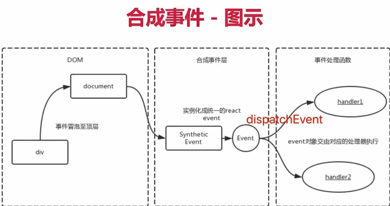
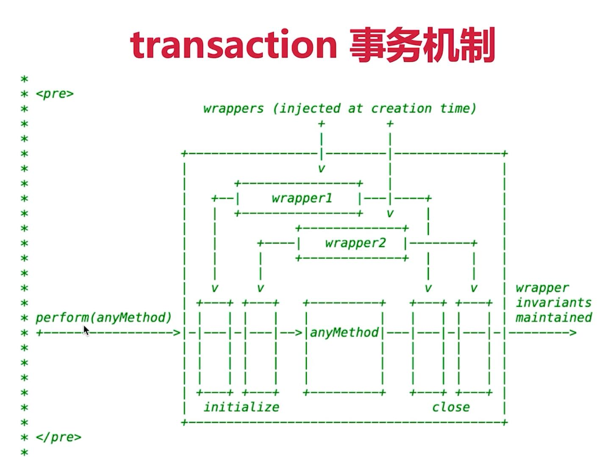

函数式编程 JSX本质 合成事件 组件渲染 setState 

<!-- more -->

#### 1.函数式编程

##### 1.1 纯函数

##### 1.2 不可变值

`state` 只能返回新值，不能修改原来的值

#### 2.vdom 和 diff

和 `vue` 里面差不多, 核心概念和实现思路都一样

#### 3.JSX 本质

`JSX` 不是 `JS` ，实际上是一个一个 `React.createElement()` 函数

- `React.createElement` 即 h 函数，返回 `vnode`， 然后用 `patch ` 渲染
- 第一个参数，可能是组件，也可能是 `html tag`
- 组件名首字母必须大写， `html tag` 必须小写，用于区分二者

##### 3.1 JSX 基本使用

`React.createElement("dom节点", "属性，没有就写 null", "子元素1", "子元素2")`

```JSX
// JSX 基本使用
const imgElem = <div id="div1">
      <p>some text</p>
      
</div>
      
// 编译以后
// JSX 基本使用
const imgElem = React.createElement("div", {
  id: "div1"
}, React.createElement("p", null, "some text"), React.createElement("img", {
  src: imgUrl
}));
```

##### 3.2 JSX style

```JSX
const styleData = {
  fontSize: '30px',
  color: 'blue'
}
const styleElem = <p style = {styleData}>
      设置 style
</p>

// 编译后
const styleData = {
  fontSize: '30px',
  color: 'blue'
};
const styleElem = /*#__PURE__*/React.createElement("p", {
  style: styleData
}, "\u8BBE\u7F6E style");
```


##### 3.3 JSX 组件

`React.createElement(组件名, {属性，没有就写 null}, "子元素1", "子元素2")`

```JSX 
const app = <div>
      <Input submitTitle = { onSubmitTitle }/>
      <List list = { list } />
</div>

// 编译后
const app =  React.createElement("div", null,  React.createElement(Input, {
  submitTitle: onSubmitTitle
}),  React.createElement(List, {
  list: list
}));
```

##### 3.4 JSX 事件

```JSX
const eventList = <p onClick = { this.clickHandler }>
      some text
</p >

// 编译后
const eventList =React.createElement("p", {
  onClick: (void 0).clickHandler
}, "some text");
```


##### 3.5 列表渲染

```JSX
const listElem = <ul >
        {this.state.list.map((item, index)=>{
          return <li key = {item.id}> 
            Index: {index}
            Title: {item.title}
          </li>
        })}
</ul >

const listElem = React.createElement("ul", null, (void 0).state.list.map((item, index) => {
  return React.createElement("li", {
    key: item.id
  }, "Index: ", index, "Title: ", item.title);
}));
```


#### 4.合成事件

##### 4.1 现象

- 所有事件都挂载到 `root` 上
- `event` 不是原生的，是 `SyntheticEvent` 合成事件对象
- 和 `Vue` 事件不同，和 `DOM` 事件也不同

`eg:`

```js
clickHandler2 = (event)=>{
        event.preventDefault() // 阻止默认行为
        event.stopPropagation() // 阻止冒泡
        console.log('event target',event.target);  // 指向当前元素
        console.log('event currentTarget',event.currentTarget); // 看似是一样的，但实际上不一样
        console.log('event',event);  // 这个 event 不是原生的 event ，是 react 封装的 SyntheticBaseEvent
        console.log('event.__proto__.constructor',event.__proto__.constructor);
        // 原生 event 如下
        console.log('nativeEvent',event.nativeEvent);  // 可以获得原生事件 PointerEvent
        console.log('nativeEvent target',event.nativeEvent.target);  // 拿到触发的实例 a 标签
        console.log('nativeEvent currentTarget',event.nativeEvent.currentTarget); // 绑定到了 root 上

        // 1. event 是 SyntheticEvent ，模拟出来 DOM 事件所有能力
        // 2. event.nativeEvent 是原生事件对象
        // 3. 所有的事件，都被挂载到 root 上
        // 4. 和 DOM 事件不一样，和 Vue 事件也不一样
    }
```

图示：

 

##### 4.2 为什么要合成事件机制

- 更好的兼容性和跨平台
- 挂载到 `root`, 减少内存消耗，避免频繁解绑
- 方便事件的 **统一管理**（如事务机制）

#### 5.setState batchUpdate机制（important）

`setState`有时异步，有时同步（比如在 `setTimeout`, `DOM` 事件中）；有时合并执行（对象形式），有时不合并执行（函数形式）

##### 5.1 setState 主流程


##### 5.2 isBatchingUpdates

`setState` 本身无所谓异步还是同步，它是同步还是异步取决于有没有命中 `batchUpdate` 机制，如果 `isBatchingUpdates` 是 `false` 说明已经更新完了，可以拿到最新值。 

`eg:` 简略说明，实际上比这个复杂得多

```js
// setState 在 setTimeout 中是同步的，可以拿到最新值
increase = () => {
    	// 开始执行：batchUpdate
    	// 1.isBatchingUpdates = true
        setTimeout(() => {
            // 3. isBatchingUpdates = false
            // 更新完毕，可以拿到最新值
            this.setState({
                count: this.state.count + 1
            })
            console.log('setTimeout 打印的值',this.state.count); // 打印的值是最新值
        }, 0);
        
}
// 结束：batchUpdate
// 2.isBatchingUpdates = false
```


```js
increase = () => {
    	// 开始执行 batchUpdate
    	// 1.isBatchingUpdates = true
        this.setState({
            count: this.state.count + 1
        })
        console.log(this.state.count);  // 只能拿到修改前的值
    	// 结束：batchUpdate
		// 2.isBatchingUpdates = false
    }
```

##### 5.3 是否命中 batchUpdate 机制

可以命中

- 生命周期（和它调用的函数）
- `React` 中注册的事件（和它调用的函数）
- `React` 可以“管理”的入口

不可以命中

- `setTimeout setInterval` 等（和它调用的函数）
- 自定义的 DOM 事件（和它调用的函数）
- `React` 不可以“管理”的入口

##### 5.4 transaction 事物机制



最底层： `initalize` → `anyMethod`→`close`

#### 6.组件渲染过程

`JSX` 渲染为页面，`setState` 之后更新页面

##### 6.1组件渲染

- `props` `state` (数据)
- `render()` 生成 `vnode`
- `patch(elem, vnode) patch(oldVnode, newVnode)`

##### 6.2 更新的两个阶段和 fiber

`patch` 分为两个阶段：

- `reconciliation` 阶段 - 执行 `diff算法` （纯 JS 计算）
- `commit` 阶段 - 将 `diff` 结果渲染 `DOM` 

**如果不拆分阶段的话，可能会有一些性能问题：**

- JS 是单线程，且和 DOM 渲染共用一个线程
- 当组件足够复杂，组件更新时计算和渲染压力都大
- 如果再有 DOM 操作需求（动画，鼠标拖拽等），可能会造成卡顿

**fiber**

- 将 `reconciliation` 阶段进行任务拆分（`commit` 无法拆分）
- `DOM` 需要渲染时暂停，空闲时恢复
- API:  `window.requestIdleCallback`


