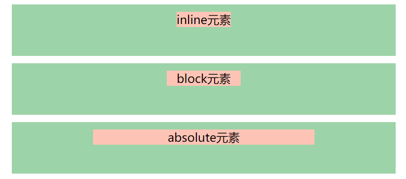

### 1.absolute和relative分别依据什么定位

<!-- more -->

- 子绝父相
- relative 根据自身定位 对外界元素不会有任何影响
- absolute 根据最近一层父元素定位

### 2.居中对齐有什么方式

- 水平居中 

  - inline元素 text-align：center 给父元素给自身都可以 它没有宽高 只是看文字
  - block元素 margin：auto 给自身
  - absolute元素 left：50% + margin-left 负值 （子元素的宽度的一半）给自身 注意父元素要relative

  ```html
  <title>水平居中</title>
      <style>
           .container{
                
               background-color: #9dd3a8;
               margin: 10px;
               padding: 10px;
               width: 500px;
               height: 50px;
           }
           .item{
               background-color: #fdc4b6;
               text-align: center;
                
           }
           .container-1{
               text-align: center;
           }
           .container-2 .item{
              width: 100px;
              margin: auto;
           }
           .container-3{
               position: relative; 
           }
           .container-3 .item{
               position: absolute;
               width: 300px;
               left: 50%;
               margin-left: -150px;
           }
      </style>
  </head>
  <body>
      <div class="container container-1">
          <span class="item">
              inline元素
          </span>
      </div>
  
      <div class="container container-2 ">
          <div class="item">
              block元素
          </div>
      </div>
  
      <div class="container  container-3">
          <div class="item">
              absolute元素
          </div>
      </div>
  </body>
  ```

  

- 垂直居中（和水平居中情况类似）

  - inline元素：line-height 等于height

  - absolute元素：

    - top：50% + margin-top负值  （知道子元素的高度）
    - left:  50% + top: 50% + transform: translate(-50%，-50%)
    - top left right bottom = 0 + margin：auto 
