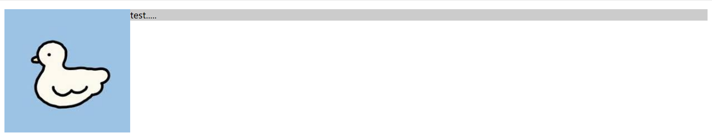
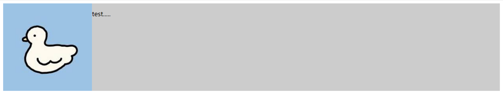
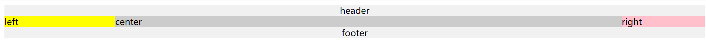
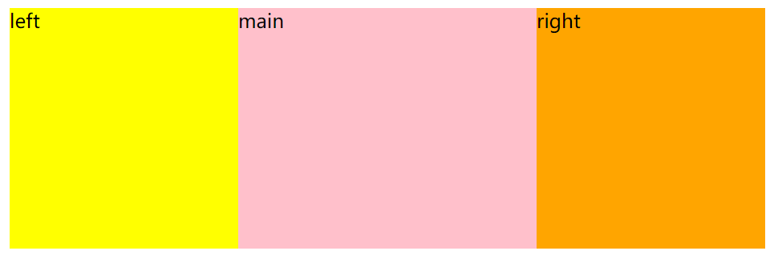
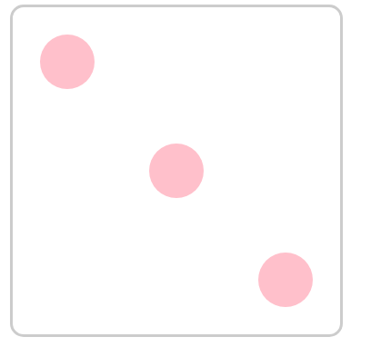

#### title: 前端面试CSS 布局
date: 2021-10-20 14:51:13
tags: 盒模型 margin BFC 圣杯/双飞翼布局 flex布局

### 1.盒子模型的宽度如何计算

<!-- more -->

#### Q:div1 的offsetWidth 为多大？

offsetWidth=（内容宽度 + 内边距 + 边框），无外边距（也就是没有margin）

``` html
<style>
        #div1{
            width: 100px;
            padding: 10px;
            border: 1px solid #ccc;
            margin: 10px;
            background-color: pink;
        }
</style>
<body>
    <div id="div1"></div>
</body>
    
```

A1：122px

Q2：如果要让`offsetWidth`等于100 该怎么做？

A2： 加 `box-sizing: border-box;` 也就是说让width不再是单纯的内容宽度，而是border-box的宽度（包括到边框的宽度，也就是offsetWidth），这样内容宽度会缩小，但是padding和border和margin不会

补充：box-sizing 有两个属性。

```css
/* 针对标准盒模型，width 只是 content 的宽度 所以一般来说也不用写这个属性*/
box-sizing: content-box; 
/* width 指的是 border + padding + contentWidth 也就是说设定了 width 之后，content的宽度相当于是计算出来的 */
box-sizing: border-box;
```


### 2.margin纵向重叠的问题

Q：AAA和BBB之间的距离是多少？

``` html
<style>
        /* margin纵向重叠 */
        p {
            font-size: 16px;
            line-height: 1;
            margin-top: 10px;
            margin-bottom: 15px;
        }
    </style>
<body>
    <p>AAA</p>
    <p></p>
    <p></p>
    <p></p>
    <p>BBB</p>
</body>
```

A：15px

相邻元素的margin-top 和 margin-bottom 会发生重叠，空白内容的 p 标签页会被重叠（我的理解是没有高度也没有内容的情况下，设置margin也没用，忽略即可）。 

### 3.margin负值的问题

Q：margin的bottom top left right设置成负值分别的作用

``` html
 <style>
        body{
            margin: 20px;
        }
        .float-left{
            float: left;
        }
     	/* 清除浮动 */
        .clearfix:after{
            content: '';
            display: table;  /*默认伪元素是行内元素，所以display设置改为块级元素*/
            clear: both;
        }
        .container{
            border: 1px solid #ccc;
            padding: 10px;
        }
        .container .item{
            width: 100px;
            height: 100px;
        }
        .container .border-blue{
            border: 1px solid blue;
        }
        .container .border-red{
            border: 1px solid red;
        }
    </style>
</head>
<body>
    <p>marigin top bottom 为负值的情况</p>
    <div class="container">
        <!-- 设置top 负值 item1自己往上移动 设置bottom负值 item2往上移动-->
        <div class="item border-blue" style="margin-top: -20px;">
            this is item1
        </div>        
        <div class="item border-red">
            this is item2
        </div>
    </div>
    <p>marigin left right 为负值的情况</p>
    <div class="container clearfix">
         <!-- 设置left 负值 item1自己往左移动 设置right负值 item2往左移动-->
        <div class="item border-blue float-left" style="margin-left: -20px;">
            this is item3
        </div>        
        <div class="item border-red float-left">
            this is item4
        </div>
    </div>
</body>
```

A：

- margin-top 和 margin-left 负值，元素向上、向左移动；
- margin-right负值，右侧元素左移，自身不受影响；
- margin-bottom负值，下方元素上移，自身元素不受影响
- 总的来说，都是让元素向左移/上移，只不过一个让自己移动，一个让别人移动

### 4.BFC理解和应用

一般来说直接问，因为没有很适合的场景

Q: 什么是BFC以及如何应用

A：

- Block format context：块级格式化上下文；一块独立渲染区域，内部元素的渲染不会影响边界以外的元素

- 形成BFC的常见条件

  - float 不是 none
  - position 是 absolute 或 fixed
  - overflow 不是 visible
  - display 是 flex inline-block等 前三者比较常用

- BFC的常见应用

  - 清除浮动（可以用clearfix也可以用BFC）

  ``` html
  <style>
          .container{
              background-color: #ccc;
          }
          .left{
              float: left;
          }
      </style>
  </head>
  <body>
      <div class="container">
          
          <p>test.....</p>
      </div>
  </body>
  ```

  因为图片设置了浮动，所以会脱离文本流，飘在上面，但是没有bfc时，不会撑开自己本身的div，从而影响到其它块外的元素

  

  用 overflow: hidden; 触发块级元素的bfc，也就是container的bfc，使得它里面的元素独立渲染

  ``` html
  //style增加加
  .bfc{
              overflow: hidden;
       }
  //container增加
  <div class="container bfc"></div>
  ```

   

- 解决 margin 塌陷的问题

​		分别设置两个垂直元素具有margin-bottom, margin-top 属性，此时会出现高度塌陷的情况，

​	    如果让两个元素触发 BFC 就不 会互相影响了

- 阻止元素被浮动元素覆盖

  两个同级 div，设置了 float 的会覆盖不设置的，所以可以给没有设置 float 的元素触发 BFC 属性

### 5.float布局的问题以及 clearfix

#### Q1:float布局：圣杯布局 

#### A1:

- 目的：

  - 三栏布局，中间一栏最先加载和渲染（内容最重要）
  - 两侧内容固定，中间内容随着宽度自适应
  - 一般用于PC网页

- 技术总结（按照这三点来写代码，回答问题）

  - 使用float布局
  - 两侧使用margin负值，以便和中间内容横向重叠
  - 防止中间内容被两侧覆盖，padding+margin

- 思路：

  1.首先是把大布局写好，然后给中间栏三列都设置 `float:left` ，不要分开设置，不然会不稳定，然后给 footer 清除浮动 `clear:both`

  2.为了自适应布局，中间列只能设置 `width:100%`, 为了让 left 和 right 能移上来，设置 margin-left:-100% 就能移动到最左边，而 right 只需要移动到右边够自己就够了，所以只需要向左边移动自身距离

  3.但是，这样还有缺点，就是中间其实被左右挡住了，所以内容也会被遮盖。此时需要给 container 设置 padding。padding 的目的是给中间栏空出位置，两边空格的留给 left right

  4.想要 left 和 right 移动到此时 padding 留出来的位置，需要给自身设置相对定位脱离文档流，然后就可以设置 left right top bottom了。当然我们只需要 left:-本身宽度 right:- 本身宽度就可以让它们相对自己移动过去了。

  ``` html
  
   
  	<body>
      <div class="header">header</div>
      <div class="container">
          <!-- center 最重要所以最先渲染 -->
          <div class="center column">center</div>
          <div class="left column">left</div>
          <div class="right column">right</div>
      </div>
      <div class="footer">footer</div>
      <style>
        .header{
          text-align: center;
          background-color: #ccc;
        }
        .container{
          padding: 0 200px;
        }
        .center{
          text-align: center;
          background-color: pink;
          width: 100%;
        }
        .left{
            text-align: center;
            background-color: red;
            width: 200px;
            margin-left: -100%;
            position: relative;
            left: -200px;
  
        }
        .right{
            text-align: center;
            background-color: orange;
            width: 200px;
            margin-left: -200px;
            position: relative;
            right:-200px
  
        }
        .column{
          float: left;
        }
        .footer{
          clear: both;
          text-align: center;
          background-color: #ccc;
  
        }
      </style>
    </body>
  
  
  ```

  

#### Q2:双飞翼布局

和圣杯布局不一样的在于中间一栏用了一个 div 包起来

#### A2：用margin留白 用margin-left移动 比较简单

``` html
<body>   
    <div class="container">
        <div class="center column">
            <div class="content column">
                main
            </div>
        </div>
        <div class="left column">left</div>
        <div class="right column">right</div>
    </div>
   
    <style>
     
     *{
         margin: 0;
         padding: 0;
     }
      .column{
        float: left;
      }
      .left{
        width: 200px;
        background-color: #ccc;
        margin-left: -100%;   
      }
      .right{
        width: 200px;
        background-color: red;
        margin-left: -200px;  
      }
      .center{
        width: 100%;
        background-color: pink;

      }
      .content{
        background-color: orange;
        margin-left: 200px;  
        margin-right: 200px;
      }
      
    </style>
  </body>
```



#### Q3:手写clearfix

#### A3：如下

``` css
/* 比如说圣杯布局 不给foot单独加去浮动的话，可以给container加这个清除浮动 不影响后面的元素 */
        .clearfix::after{
            content: '';
            display: table;
            clear: both;
        }
```


#### Q4:双栏布局？

float左浮动左边，右边margin-left 撑开，父元素设置 BFC

```html
<div class="box">
    <div class="left"></div>
    <div class="right"></div>
  </div>
  <div class="test"></div>

  <style>
    .box{ 
      overflow: hidden;
    }
    .test{
      float: left;
      width: 100px;
      height: 100px;
      background-color: #ccc;
    }
    .left{
      float: left;
      width: 50px;
      height: 200px;
      background-color: skyblue;
    }
    .right{
      margin-left: 80px;
      width: 150px;
      height: 200px;
      background-color: orangered;

    }
  </style>
```


### 6.flex布局 

`Flexible Box` 简称 `flex`，意为”弹性布局”，可以简便、完整、响应式地实现各种页面布局。采用Flex布局的元素，称为`flex`容器`container`。它的所有子元素自动成为容器成员，称为`flex`项目`item`

**容器属性有：**

```css
flex-direction: row | row-reverse | column | column-reverse;  
flex-wrap: nowrap | wrap | wrap-reverse;
flex-flow: <flex-direction> || <flex-wrap>;
justify-content: flex-start | flex-end | center | space-between | space-around;
align-items: flex-start | flex-end | center | baseline | stretch;
align-content
```

**容器成员属性如下：**

```css
order
flex-grow
flex-shrink
flex-basis
flex
align-self
```

应用：元素居中 两栏三栏布局


#### Q：实现一个三点的色子

A：

``` html
<style>
        .box{
            width: 200px;
            height: 200px;
            border: 2px solid #ccc;
            border-radius: 10px;
            padding: 20px;

            /* 关键 */
            display: flex;
            justify-content: space-between; //两端对齐

        }
        .item{
            /* span这种要设置 block 属性，div 就不用了 */
            display: block;
            width: 40px;
            height: 40px;
            border-radius: 50%;
            background-color: pink;
            
        }
        /* 关键 */
        .item:nth-child(2){
            align-self: center; //第二项居中对齐
        }
        .item:nth-child(3){
            align-self: flex-end; //第三项尾对齐
        }
    </style>
</head>
<body>
    <div class="box">
        <span class="item"></span>
        <span class="item"></span>
        <span class="item"></span>
    </div>
</body>
```





### 7.元素水平垂直居中

分两种情况：元素宽高已知和元素宽高未知

实现的方法有好几种，我挑了比较常用的

1.绝大多数情况下，设置父元素为相对定位， 子元素绝对定位 + 移动自身50%实现水平垂直居中

不要求父元素的高度，需要知道子元素自身的宽高，

```html
 <div class="parent">
    <div class="child">

    </div>
  </div>

  <style>
    .parent{
      /* 如果 parent 不设置 relative 的话，子元素就是在屏幕水平居中 */
     position: relative;
      width: 200px;
      height: 200px;
      background-color: skyblue;
    }
    .child{
      position:absolute;
      top: 50%;
      left: 50%;
      margin-top: -50px;
      margin-left: -50px;
      width: 100px;
      height: 100px;
      background-color: pink;
    }
  </style>
```

2.flex布局

给父元素设置即可，`display:flex;  align-items:center;  justify-content: center;`

```html
<div class="parent">
    <div class="child">

    </div>
  </div>

  <style>
    .parent{
      display: flex;
      /* 垂直居中 */
      align-items: center;  
      /* 水平居中 */
      justify-content: center;
      width: 200px;
      height: 200px;
      background-color: skyblue;
    }
    .child{
      width: 100px;
      height: 100px;
      background-color: pink;
    }
  </style>
```

3.grid布局，兼容性比较差

给父元素设置即可，`display:grid;  align-items:center;  justify-content: center;`

```html
<style>
    .father {
            display: grid;
            align-items:center;
            justify-content: center;
            width: 200px;
            height: 200px;
            background: skyblue;

        }
        .son {
            width: 10px;
            height: 10px;
            border: 1px solid red
        }
</style>
<div class="father">
    <div class="son"></div>
</div>
```

### 8.实现一个三角形

宽高为 0 四边设置透明 设置需要的方向的边框颜色

```css
<style>
    .box{
      width: 0px;
      height: 0px;
      border: 100px solid transparent;
      border-bottom-color: pink;
     
    }
  </style>
```

